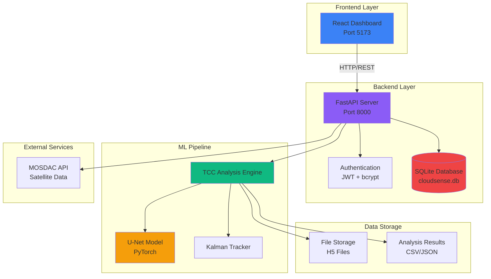
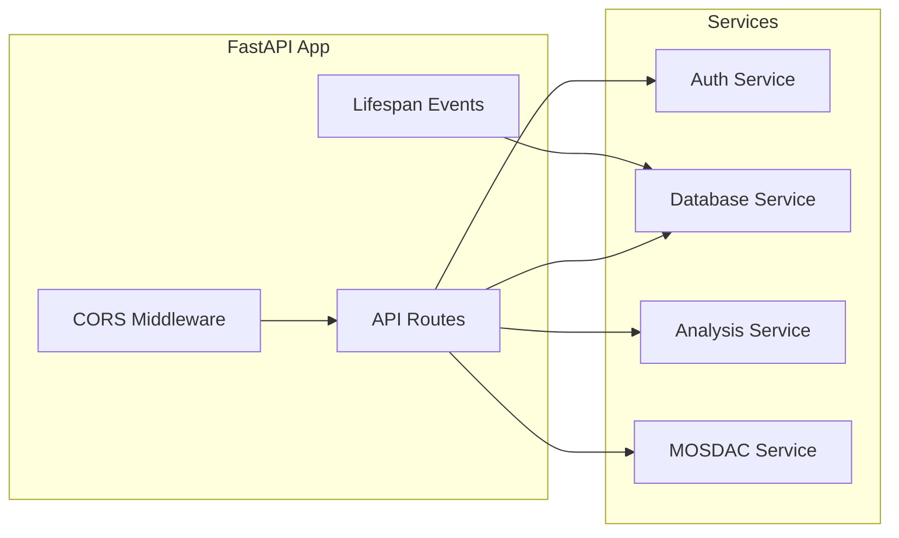
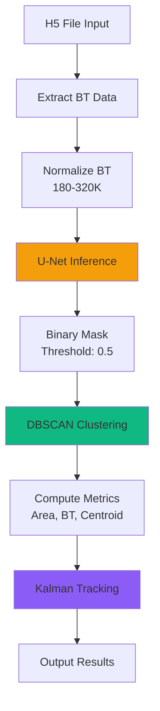
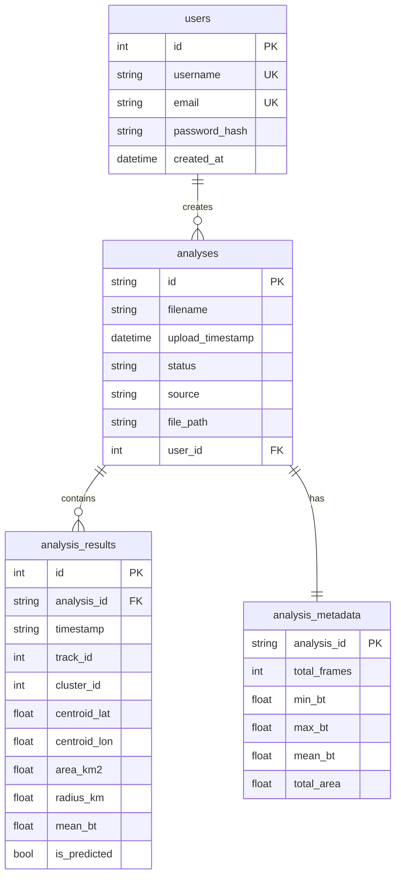
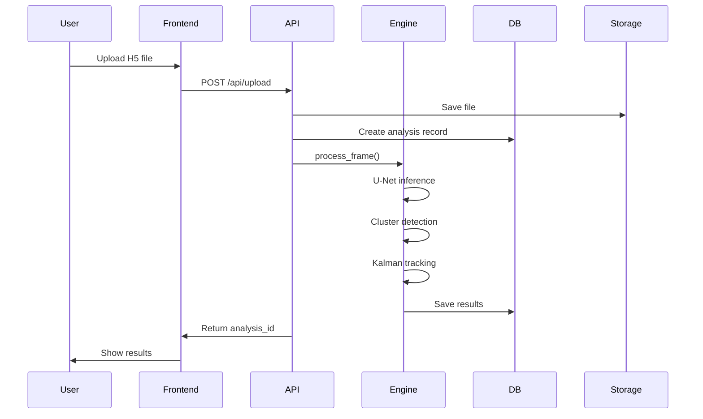
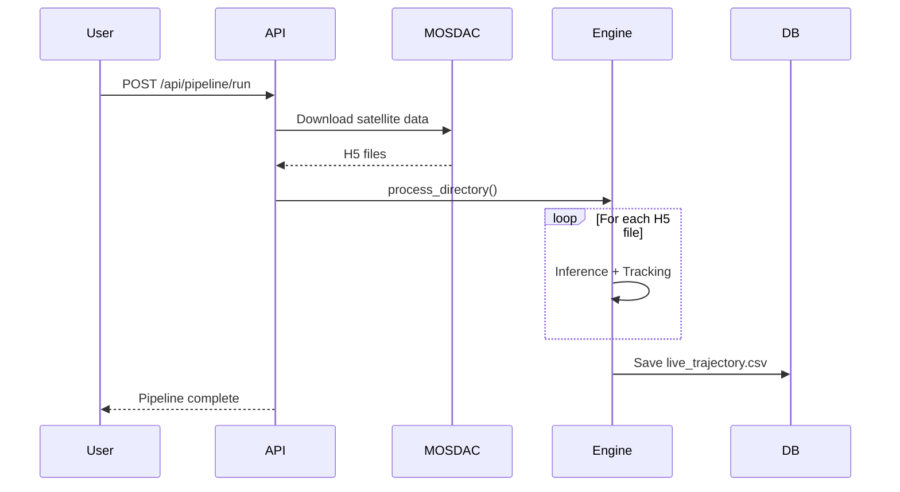
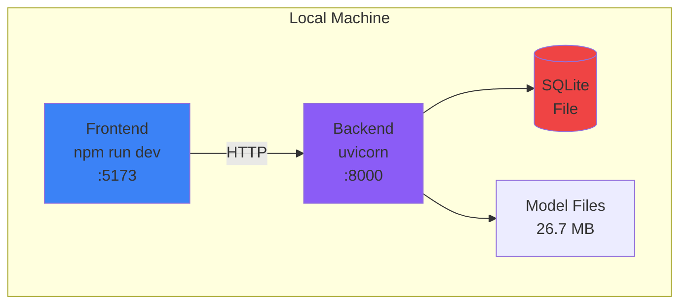
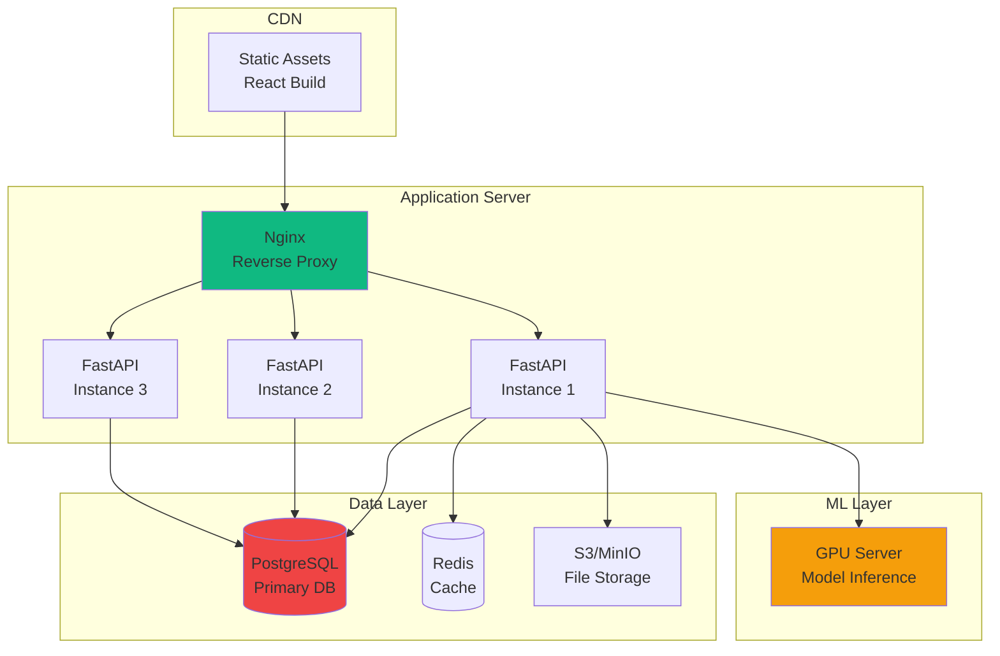

# CloudSense - System Architecture Documentation

## 📋 Table of Contents
1. [System Overview](#system-overview)
2. [High-Level Architecture](#high-level-architecture)
3. [Component Details](#component-details)
4. [Data Flow](#data-flow)
5. [Technology Stack](#technology-stack)
6. [API Architecture](#api-architecture)
7. [Database Schema](#database-schema)
8. [Deployment Architecture](#deployment-architecture)

---

## 🌐 System Overview

**CloudSense** is an AI-powered tropical cloud intelligence system for real-time detection and tracking of Tropical Cloud Clusters (TCCs) using satellite imagery and deep learning.

**Primary Use Case:** Monitor and track tropical cyclones in the Indian Ocean region using INSAT-3D satellite data.

---

## 🏗️ High-Level Architecture



---

## 🔧 Component Details

### 1. Frontend (React + Vite)

**Location:** `/frontend/`

**Key Components:**
- **Landing Page** - Marketing/info page
- **Dashboard** - Real-time TCC monitoring with world map
- **Data Upload** - Manual H5 file upload interface
- **Analysis** - Historical analysis viewer
- **Tracking** - Trajectory visualization
- **Insights** - AI-powered analysis
- **Exports** - NetCDF data export
- **Chat** - AI chatbot for queries

**Tech Stack:**
- React 18.3.1
- React Router 6.30.1
- TanStack Query (data fetching)
- Tailwind CSS + shadcn/ui
- Recharts (visualization)

**State Management:**
- React Context API (`AnalysisContext`)
- TanStack Query for server state
- localStorage for auth tokens

---

### 2. Backend (FastAPI)

**Location:** `/backend/`

**Core Files:**
- `app.py` - Main FastAPI application
- `auth.py` - JWT authentication
- `db.py` - SQLite database operations
- `analysis_engine.py` - Basic ML inference
- `tcc_analysis_engine.py` - Advanced TCC detection
- `mosdac_manager.py` - MOSDAC API integration

**Architecture Pattern:** Monolithic with service layer separation



---

### 3. ML Pipeline

**Location:** `/models/` and `/backend/tcc_analysis_engine.py`

**Components:**

#### a) U-Net Segmentation Model
- **Architecture:** MobileNetV2 encoder + U-Net decoder
- **Input:** 512x512 brightness temperature (BT) images
- **Output:** Binary cloud mask (TCC vs background)
- **Framework:** PyTorch + segmentation-models-pytorch
- **Model File:** `models/models/best_model.pth` (26.7 MB)

#### b) TCC Detection Pipeline


#### c) Kalman Filter Tracking
- **State Vector:** [lat, lon, velocity_lat, velocity_lon]
- **Measurement:** [lat, lon] from cluster centroids
- **Purpose:** Smooth trajectories, handle missing observations
- **Gating:** Reject outliers >200km from prediction

---

### 4. Database Schema

**Type:** SQLite (single file: `cloudsense.db`)



---

## 🔄 Data Flow

### User Upload Flow



### Live Data Pipeline Flow



---

## 🛠️ Technology Stack

### Frontend
| Category | Technology | Version |
|----------|-----------|---------|
| Framework | React | 18.3.1 |
| Build Tool | Vite | 5.4.19 |
| Routing | React Router | 6.30.1 |
| State | TanStack Query | 5.90.20 |
| Styling | Tailwind CSS | 3.4.17 |
| UI Components | shadcn/ui + Radix UI | Latest |
| Charts | Recharts | 2.15.4 |

### Backend
| Category | Technology | Version |
|----------|-----------|---------|
| Framework | FastAPI | >=0.100.0 |
| Server | Uvicorn | >=0.23.0 |
| Database | SQLite | 3.x |
| Auth | PyJWT + bcrypt | Latest |
| Validation | Pydantic | >=2.0.0 |

### ML/Data Science
| Category | Technology | Version |
|----------|-----------|---------|
| Deep Learning | PyTorch | >=2.0.0 |
| Segmentation | segmentation-models-pytorch | >=0.3.0 |
| Computer Vision | OpenCV | >=4.8.0 |
| Data Processing | NumPy, Pandas | Latest |
| Clustering | scikit-learn (DBSCAN) | >=1.3.0 |
| Tracking | OpenCV Kalman Filter | >=4.8.0 |
| Data Format | h5py (HDF5) | >=3.9.0 |

---

## 📡 API Architecture

### Authentication Endpoints
```
POST   /api/auth/signup       - Register new user
POST   /api/auth/login        - Login with email/password
GET    /api/auth/verify       - Verify JWT token
```

### Analysis Endpoints
```
POST   /api/upload                          - Upload H5 file for analysis
GET    /api/analysis/{id}/status            - Get analysis status
GET    /api/analysis/{id}/trajectory        - Get trajectory data
GET    /api/analysis/{id}/metadata          - Get analysis metadata
GET    /api/analyses/recent?limit=10        - List recent analyses
```

### Data Endpoints
```
GET    /api/analysis/trajectory             - Get Kalman trajectory CSV
GET    /api/analysis/clusters               - Get active cluster stats
POST   /api/pipeline/run                    - Run full MOSDAC pipeline
```

### System Endpoints
```
GET    /health                              - Health check
GET    /static/analysis/{file}              - Serve static files
```

---

## 🗄️ File Structure

```
cloudsense/
├── frontend/                    # React application
│   ├── src/
│   │   ├── components/         # Reusable UI components
│   │   ├── pages/              # Route pages
│   │   ├── contexts/           # React contexts
│   │   ├── hooks/              # Custom hooks
│   │   ├── lib/                # Utilities
│   │   └── services/           # API clients
│   ├── public/                 # Static assets
│   └── package.json
│
├── backend/                     # FastAPI server
│   ├── app.py                  # Main application
│   ├── auth.py                 # Authentication
│   ├── db.py                   # Database operations
│   ├── analysis_engine.py      # Basic ML engine
│   ├── tcc_analysis_engine.py  # Advanced TCC engine
│   ├── mosdac_manager.py       # MOSDAC integration
│   ├── services/               # Service clients
│   ├── routes/                 # Additional routes
│   └── cloudsense.db           # SQLite database
│
├── models/                      # ML models
│   ├── models/
│   │   └── best_model.pth      # Trained U-Net (26.7 MB)
│   ├── inference.py            # Standalone inference
│   └── train.py                # Training script
│
├── training/                    # Training data & scripts
│   ├── data/                   # Historical satellite data
│   └── trajectory_kalman.csv   # Michaung cyclone data
│
├── michaung_analysis/           # Live analysis results
│   └── live_trajectory.csv     # Real-time tracking data
│
└── README.md                    # Documentation
```

---

## 🚀 Deployment Architecture

### Current Setup (Development)



### Recommended Production Setup



---

## 🔐 Security Architecture

### Current Implementation
- **Authentication:** JWT tokens (HS256)
- **Password Hashing:** bcrypt
- **CORS:** Configured for localhost
- **Token Storage:** localStorage (frontend)

### Security Concerns (From Code Review)
⚠️ See [`code_review.md`](file:///Users/dhanush/.gemini/antigravity/brain/89c3a8a5-b689-4274-be34-be7edf7db359/code_review.md) for detailed security issues

---

## 📊 Performance Characteristics

### Model Inference
- **Input Size:** 512x512 pixels
- **Inference Time:** ~100-200ms (CPU), ~20-50ms (GPU)
- **Model Size:** 26.7 MB
- **Device:** MPS (Mac) or CPU fallback

### Database
- **Type:** SQLite (single-threaded)
- **Limitation:** Not suitable for high concurrency
- **Recommendation:** Migrate to PostgreSQL for production

### API Response Times
- `/health`: <10ms
- `/api/upload`: 2-5 seconds (includes inference)
- `/api/analysis/clusters`: <100ms
- `/api/pipeline/run`: Minutes (depends on data volume)

---

## 🔄 Data Processing Pipeline

### Brightness Temperature (BT) Processing
```
Raw Counts → LUT Mapping → BT (Kelvin) → Normalization → U-Net Input
```

### TCC Detection Parameters
- **BT Threshold:** 218K (cold cloud tops)
- **Pixel Resolution:** 4km × 4km
- **Minimum TCC Area:** 34,800 km²
- **DBSCAN eps:** 1.5 pixels
- **DBSCAN min_samples:** 5

### Tracking Parameters
- **Max Track Distance:** 200 km
- **Track Lost Threshold:** 3 frames
- **Kalman Process Noise:** 0.03
- **Kalman Measurement Noise:** 1.0

---

## 📈 Scalability Considerations

### Current Limitations
1. SQLite (single-threaded writes)
2. Synchronous DB calls in async endpoints
3. No horizontal scaling
4. No load balancing
5. No caching layer

### Scaling Recommendations
1. **Database:** PostgreSQL with connection pooling
2. **Caching:** Redis for frequently accessed data
3. **File Storage:** S3/MinIO instead of local filesystem
4. **API:** Multiple FastAPI instances behind Nginx
5. **ML:** Separate GPU inference service
6. **Queue:** Celery for async processing

---

## 🎯 Summary

CloudSense is a **monolithic full-stack application** with:
- **Frontend:** React SPA with modern UI
- **Backend:** FastAPI with JWT auth
- **ML:** PyTorch U-Net for cloud segmentation
- **Tracking:** Kalman filter for trajectory smoothing
- **Database:** SQLite for persistence
- **External:** MOSDAC API for satellite data

**Current Status:** Functional for development/research, requires hardening for production use.

**Next Steps:** Address security issues from code review, add tests, improve error handling, and implement production deployment architecture.
